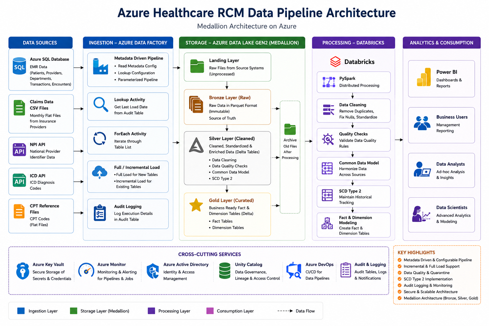

# Azure Data Engineering Project – Healthcare Revenue Cycle Management

## Project Overview

This project demonstrates an end-to-end Azure Data Engineering solution for the Healthcare Revenue Cycle Management domain.

Revenue Cycle Management is the process hospitals use to manage financial activities from patient registration to provider payment. The goal of this project is to build scalable data pipelines that ingest, process, clean, and transform healthcare data into analytics-ready fact and dimension tables.

The project follows the Medallion Architecture:

Landing → Bronze → Silver → Gold

## Business Use Case

Hospitals need accurate reporting for Accounts Receivable and payment tracking. This project helps reporting teams calculate important KPIs such as:

- AR greater than 90 days
- Days in AR
- Claim status tracking
- Patient payment responsibility
- Provider and department-level financial reporting

## Tech Stack

- Azure Data Factory
- Azure Databricks
- Azure Data Lake Storage Gen2
- Azure SQL Database
- Delta Lake
- Azure Key Vault
- PySpark
- SQL
- Parquet
- Unity Catalog

## Data Sources

The project uses multiple healthcare data sources:

### EMR Data – Azure SQL Database

- Patients
- Providers
- Departments
- Transactions
- Encounters

### Claims Data

- Monthly flat files from insurance providers

### API Data

- NPI data
- ICD code data

### Reference Data

- CPT codes from flat files

## Architecture Diagram (Solution Architecture)

The pipeline follows the Medallion Architecture pattern with three data layers: Bronze, Silver, and Gold.

<p align="center">
  
</p>

# 🏗️ Medallion Architecture

This project is built using the **Medallion Architecture (Landing → Bronze → Silver → Gold)**, a modern data lake design pattern that enables scalable, reliable, and high-quality data processing. The architecture separates data into progressive refinement layers, ensuring raw data preservation, standardized transformations, and analytics-ready datasets while supporting governance, auditing, and incremental processing.

---

## 📥 Landing Layer – Raw Data Ingestion

The Landing layer acts as the entry point for all incoming data from heterogeneous source systems.

### Responsibilities

- Receive raw data from multiple source systems.
- Preserve original file formats before processing.
- Support batch ingestion from external providers.
- Maintain source system integrity.
- Trigger downstream ingestion pipelines.

### Source Systems

| Source | Type | Frequency |
|---------|------|-----------|
| Azure SQL Database | EMR Data | Daily |
| Insurance Claims | CSV Files | Monthly |
| NPI Registry | REST API | Daily |
| ICD Codes | REST API | Daily |
| CPT Codes | Reference Files | Monthly |

---

## 🥉 Bronze Layer – Raw Data Repository

The Bronze layer serves as the **immutable source of truth** for the data platform.

All ingested data is stored in **Parquet format** within Azure Data Lake Storage Gen2 without applying business transformations.

### Responsibilities

- Raw data preservation
- Schema evolution support
- Historical data retention
- Source system traceability
- Incremental ingestion
- Auditability

### Technologies

- Azure Data Lake Storage Gen2
- Azure Data Factory
- Parquet
- Azure SQL Database

---

## 🥈 Silver Layer – Data Standardization & Quality

The Silver layer transforms raw datasets into standardized, trusted, analytics-ready datasets using Delta Lake.

This layer contains the majority of business transformation logic and data quality enforcement.

### Major Transformations

### ✔ Data Cleaning

- Remove duplicate records
- Handle missing values
- Standardize data formats
- Normalize column names
- Remove invalid records

---

### ✔ Common Data Model (CDM)

Data from multiple hospitals and insurance providers is transformed into a unified enterprise schema, enabling cross-source reporting and analytics.

---

### ✔ Data Quality Framework

Multiple validation rules are implemented before data is promoted to the Silver layer.

Examples include:

- Null value validation
- Duplicate detection
- Schema validation
- Data type validation
- Referential integrity checks

Invalid records are redirected to a **Quarantine Zone** for further investigation without impacting downstream processing.

---

### ✔ Slowly Changing Dimension (SCD Type 2)

Historical changes are preserved for dimensional entities.

Implemented attributes include:

- Inserted Date
- Modified Date
- Current Flag
- Effective Start Date
- Effective End Date

This allows historical reporting and point-in-time analysis.

---

### ✔ Delta Lake Implementation

Silver tables leverage Delta Lake capabilities such as:

- ACID Transactions
- Time Travel
- Schema Enforcement
- Schema Evolution
- Optimized Reads
- Data Versioning

---

## 🥇 Gold Layer – Business Ready Data

The Gold layer contains curated business datasets optimized for reporting, dashboards, KPI calculations, and executive analytics.

### Deliverables

- Fact Tables
- Dimension Tables
- Aggregated Metrics
- Reporting Views
- Executive KPIs

Examples include:

- Revenue Analytics
- Accounts Receivable KPIs
- Claim Processing Metrics
- Provider Performance
- Department Performance
- Patient Financial Analytics

---

# ⚡ Metadata Driven Azure Data Factory Pipeline

Rather than creating individual pipelines for every table, this solution implements a **metadata-driven ingestion framework**.

The pipeline dynamically reads configuration metadata and processes tables based on runtime configuration.

## Pipeline Workflow

```text
Read Metadata Configuration
            │
            ▼
Lookup Active Tables
            │
            ▼
ForEach Activity
            │
            ▼
Determine Load Type
            │
      ┌──────────────┐
      │              │
      ▼              ▼
 Full Load     Incremental Load
      │              │
      └──────┬───────┘
             ▼
Copy Data to Bronze
             │
             ▼
Archive Previous Files
             │
             ▼
Audit Logging
             │
             ▼
Databricks Processing
```

---

# ⚙️ Metadata Configuration

Each table is controlled using a centralized configuration file.

This allows onboarding new tables without modifying the pipeline.

```csv
database,datasource,tablename,loadtype,watermark,is_active,targetpath

trendytech-hospital-a,hos-a,dbo.encounters,Incremental,ModifiedDate,1,hosa
trendytech-hospital-a,hos-a,dbo.patients,Incremental,ModifiedDate,1,hosa
trendytech-hospital-a,hos-a,dbo.transactions,Incremental,ModifiedDate,1,hosa
trendytech-hospital-a,hos-a,dbo.providers,Full,,1,hosa
trendytech-hospital-a,hos-a,dbo.departments,Full,,1,hosa
```

### Configuration Fields

| Column | Purpose |
|----------|--------------------------------------|
| database | Source database |
| datasource | Hospital identifier |
| tablename | Source table |
| loadtype | Full / Incremental |
| watermark | Incremental tracking column |
| is_active | Enable or disable ingestion |
| targetpath | ADLS destination |

---

# 🚀 Enterprise Features

✔ Metadata-Driven Architecture

✔ Dynamic Pipeline Execution

✔ Full & Incremental Loading

✔ Watermark-Based Processing

✔ Delta Lake Implementation

✔ Slowly Changing Dimension (SCD Type 2)

✔ Data Quality Framework

✔ Bad Record Quarantine

✔ Audit Logging

✔ Parallel Pipeline Execution

✔ Azure Key Vault Integration

✔ Unity Catalog Integration

✔ Secure Credential Management

✔ Scalable Data Lake Architecture

✔ Enterprise Folder Structure

✔ Reusable Databricks Notebooks

✔ Configurable ETL Framework

✔ High Performance Parquet Storage

✔ Business Ready Fact & Dimension Modeling

---

# 💼 Business Value

This platform enables healthcare organizations to:

- Improve Revenue Cycle Management reporting
- Reduce manual ETL effort through automation
- Accelerate dashboard delivery
- Maintain complete historical tracking
- Improve data quality and governance
- Enable trusted analytics across multiple hospitals
- Deliver scalable enterprise reporting for finance, operations, and executive stakeholders

---

# 🎯 Technical Skills Demonstrated

**Azure:** Azure Data Factory, Azure Data Lake Storage Gen2, Azure SQL Database, Azure Key Vault

**Processing:** Azure Databricks, PySpark, Delta Lake

**Data Engineering:** ETL, ELT, Medallion Architecture, Metadata-Driven Pipelines, Incremental Loading, Watermarking, SCD Type 2, Data Quality Framework

**Data Modeling:** Star Schema, Fact Tables, Dimension Tables, Common Data Model

**Governance:** Unity Catalog, Audit Logging, Secure Secrets Management

**Languages:** SQL, Python (PySpark)

**Storage Formats:** Parquet, Delta Lake
